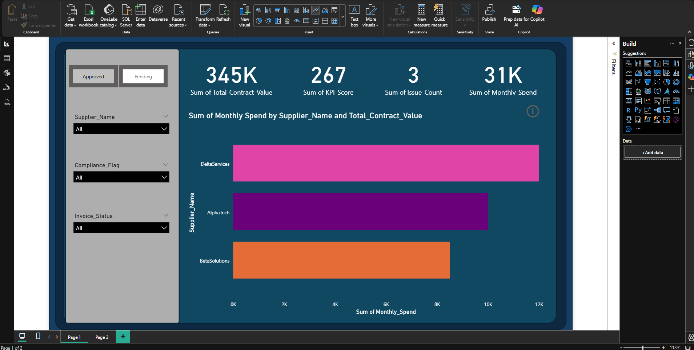

# Supplier-Management-dashboard
# 📊 Supplier Contract & Spend Dashboard

A Power BI dashboard designed to provide actionable insights into supplier performance, contract values, and monthly spend trends. Built to support procurement teams, finance analysts, and decision-makers in identifying high-value suppliers, monitoring compliance, and optimizing spend.

## 🔍 Overview

This dashboard visualizes key metrics across supplier contracts, including:

- **Total Contract Value**
- **Monthly Spend**
- **GHR Score**
- **Issue Count**
- **Compliance & Invoice Status**

Users can interact with slicers to filter by supplier name, approval status, and compliance flags—enabling dynamic analysis and targeted decision-making.

## 📌 Features

- ✅ Toggle for approved contracts
- 📊 Bar chart comparing monthly spend vs. contract value by supplier
- 🎯 KPI cards for quick performance snapshots
- 🧠 Built-in filters for compliance and invoice status
- 🛠️ Designed for scalability and integration with procurement systems

## 🧠 Tech Stack

- **Power BI Desktop**
- **Power Query** for data transformation
- **SQL** (optional backend for data sourcing)
- **Excel/CSV** for initial data inputs

## 🚀 Use Cases

- Procurement performance reviews
- Supplier risk assessments
- Budget forecasting and spend optimization
- Stakeholder reporting and executive summaries

## 👤 Author

**Ashaolu**  
DDAT, Department for Work and Pensions  
Specializing in health-focused coaching, data analysis, and stakeholder alignment.

---
